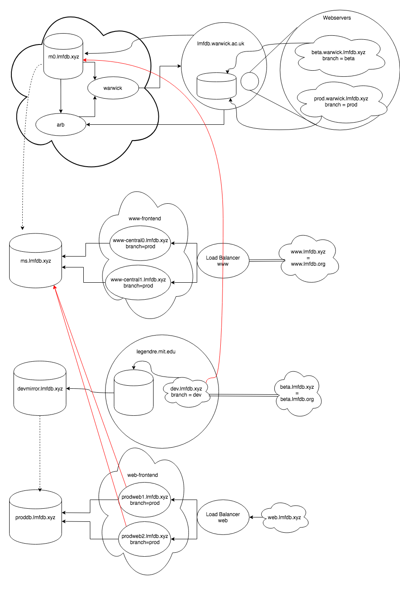

# Current setup

# Old setup

## [MongoDB setup](mongodb.md)
 
 
## [Webserver setup](webserver.md)
 
 

More details: 
 
* [Network setup](network.md)
* [Compute engine](computeengine.md), aka VMs setup
* [Bucket storage](buckets.md)
